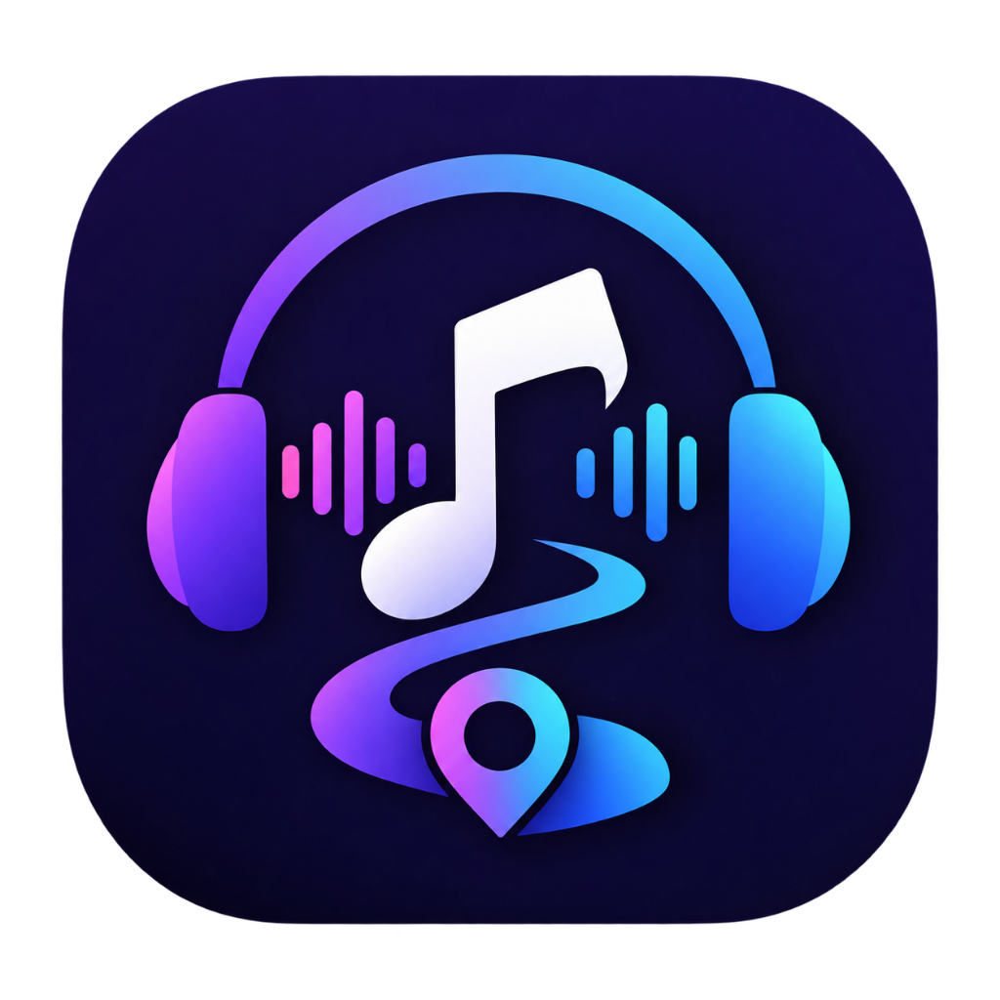
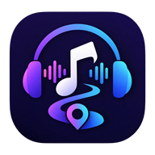

<div align="center">
  
  <h1>MelodyMap</h1>
  <p><strong>Your Music. Your Mood. Your Map.</strong></p>
  <p>A production-ready, local-first music streaming Progressive Web Application and native Android application powered by <strong>Contextual Linear Thompson Sampling (LinTS)</strong>, studio-grade Web Audio API processing, single-track playback guarantees, uninterrupted background audio, and real-time listening insights.</p>

  <p>
    <a href="https://melodymap-pi.vercel.app" target="_blank">
      
    </a>
  </p>

  <p>
    <a href="https://github.com/Naresh63-hub/MelodyMap/releases/tag/v1.0.4">
      
    </a>
    
    
    
    
    
    
    
    
    
    
  </p>
</div>

---

## 📑 Table of Contents

- [1. Project Overview](#1-project-overview)
- [2. Main Features](#2-main-features)
- [3. Screenshots & Visual Interface](#3-screenshots--visual-interface)
- [4. Technology Stack](#4-technology-stack)
- [5. Architecture Overview](#5-architecture-overview)
- [6. Project Folder Structure](#6-project-folder-structure)
- [7. Prerequisites](#7-prerequisites)
- [8. Local Installation](#8-local-installation)
- [9. Environment Variables](#9-environment-variables)
- [10. Development Commands](#10-development-commands)
- [11. Testing & Quality Assurance](#11-testing--quality-assurance)
- [12. Production Build Instructions](#12-production-build-instructions)
- [13. Android Release APK Build Instructions](#13-android-release-apk-build-instructions)
- [14. Capacitor Configuration](#14-capacitor-configuration)
- [15. Background Playback & MediaSession Implementation](#15-background-playback--mediasession-implementation)
- [16. Firebase Setup & Architecture](#16-firebase-setup--architecture)
- [17. Security Architecture & CodeQL Remediation](#17-security-architecture--codeql-remediation)
- [18. Deployment Instructions](#18-deployment-instructions)
- [19. Keyboard Shortcuts](#19-keyboard-shortcuts)
- [20. Known Limitations](#20-known-limitations)
- [21. License & Legal](#21-license--legal)

---

## 1. Project Overview

**MelodyMap** is a high-performance, local-first streaming platform and native mobile client engineered for seamless audio playback and intelligent music discovery. Built with React 19, TanStack Start, Nitro, and Capacitor Android, MelodyMap combines:

1. **Contextual Linear Thompson Sampling (LinTS)**: An adaptive Bayesian multi-armed bandit recommender dynamically adapting to user skips, completions, likes, time-of-day circadian rhythm, and session momentum.
2. **Spotify-Style Uninterrupted Background Playback**: Rock-solid audio continuity across tab switches, screen lock, app minimization, and Bluetooth/headset media controls.
3. **Resilient Dual-Engine Audio Streaming**: Serverless pre-provisioned binary resolution, pure TypeScript InnerTube fallback, and direct client playback.
4. **Studio-Grade Web Audio API Processing**: 10-band hardware equalizer, loudness normalization (-14 LUFS standard compressor), and equal-power crossfading.

---

## 2. Main Features

- 🎵 **Spotify-Grade Audio Player**: Dedicated docked mini-player, full-screen immersive view, scrub preview hairline, volume and speed controls (0.25x to 3.0x).
- 📱 **Continuous Background Playback**: Screen-off playback with Android `PARTIAL_WAKE_LOCK`, `MediaSession` integration, lock-screen artwork, and headset click-to-pause/skip controls.
- 🧠 **Contextual AI Discovery**: Real-time Bayesian bandit recommendation vector updating online after every track interaction.
- 🎚️ **10-Band Studio Equalizer**: 10 parametric biquad filters (`32Hz` to `16kHz`) with presets (`Bass Boost`, `Vocal`, `Rock`, `Acoustic`, `Flat`) plus custom curves.
- 🌙 **Background Sleep Timer**: Native Android exact alarm bridge (`SleepTimerBridge.java` & `SleepTimerReceiver.java`) that stops playback and releases WakeLock even when deep asleep.
- 🔍 **Live Debounced Multi-Catalog Search**: Fast search across YouTube Music, Deezer, Audius, Jamendo, and Internet Archive with instant deduplication.
- 📝 **Synchronized Lyrics**: Real-time timed lyrics synced via LRCLIB.
- ⏩ **SponsorBlock Auto-Skip**: Configurable automatic skipping of non-music intros, sponsor segments, and outro chatter.
- 💾 **Local-First & Offline Caching**: Complete library, playlist, and audio caching in IndexedDB; optional Firebase cross-device sync.
- 🛡️ **Zero CodeQL Vulnerabilities**: Architecturally eliminated network-to-filesystem write sinks (`js/http-to-file-access`).

---

## 3. Screenshots & Visual Interface

| Immersive Full-Screen Player | 10-Band Studio Equalizer | Mobile Home & Discovery |
| :---: | :---: | :---: |
|  |  |  |

*Explore listening insights, taste radar vectors, synchronized lyrics, and playlist curation directly in the app.*

---

## 4. Technology Stack

| Tier | Technologies |
| :--- | :--- |
| **Frontend Framework** | React 19.2, TanStack Start, TanStack Router, TanStack Query |
| **Styling & UI** | Tailwind CSS v4, Radix UI Primitives, Lucide Icons, Class Variance Authority |
| **Audio & DSP** | HTML5 Audio, Web Audio API (`AudioContext`, `BiquadFilterNode`, `DynamicsCompressorNode`), MediaSession API |
| **Server & API** | Nitro Server Engine, TanStack Start Server Functions, H3 HTTP utilities |
| **Mobile Runtime** | Capacitor 8.5 (Target SDK 36, Min SDK 24, Android Gradle 8.14.3) |
| **Database & Auth** | Firebase (Firebase Authentication, Cloud Firestore, Google Play Services 1-tap) |
| **AI & Recommendation**| Contextual Multi-Armed Bandit (Linear Thompson Sampling with Cholesky factorization) |
| **Testing** | Vitest 5.0 (218 unit/integration tests), Playwright 1.58 (6 E2E playback scenarios) |
| **Security Scanning** | GitHub CodeQL Action v3 (javascript-typescript suite), Dependabot |

---

## 5. Architecture Overview

```
┌────────────────────────────────────────────────────────────────────────┐
│                        MelodyMap Client App                           │
│   (React 19 + TanStack Router + Tailwind CSS 4 + Capacitor Native)     │
└───────────────┬────────────────────────────────────────┬───────────────┘
                │                                        │
        Playback & Controls                      Telemetry & Context
                ▼                                        ▼
┌───────────────────────────────┐        ┌───────────────────────────────┐
│     useAudioPlayer Core       │        │    Contextual LinTS Bandit    │
│  - Single Audio Element Guard │        │  - 6D Feature Extraction      │
│  - Mutual Audio Exclusion     │        │  - Cholesky Posterior Sample │
│  - Web Audio 10-Band EQ       │        │  - Online Bayesian Update     │
│  - MediaSession Lockscreen    │        │  - Feed Freshness & Dedup     │
└───────────────┬───────────────┘        └───────────────┬───────────────┘
                │                                        │
        Audio Streams                            Candidate Scoring
                ▼                                        ▼
┌───────────────────────────────┐        ┌───────────────────────────────┐
│   Hybrid Stream Resolvers     │        │  Multi-Source Music Catalogs  │
│  - Pre-Provisioned yt-dlp     │        │  - YouTube Music Hybrid API   │
│  - Pure TS InnerTube Fallback │        │  - Deezer Search API          │
│  - Deezer CDN Direct Previews │        │  - Audius / Jamendo / Archive │
│  - LRCLIB Synchronized Lyrics │        │  - In-Memory LRU Cache        │
└───────────────────────────────┘        └───────────────────────────────┘
```

---

## 6. Project Folder Structure

```
MelodyMap/
├── .github/
│   └── workflows/
│       ├── ci.yml                 # Automated CI: Vitest, Typecheck, Build, Playwright E2E
│       └── codeql.yml             # GitHub CodeQL security analysis workflow
├── android/                       # Capacitor native Android Gradle project
│   ├── app/
│   │   ├── build.gradle           # Application ID, SDK 36, versionCode 2, versionName 1.0.1
│   │   └── src/main/
│   │       ├── AndroidManifest.xml# Permissions: WAKE_LOCK, FOREGROUND_SERVICE, SCHEDULE_EXACT_ALARM
│   │       ├── java/com/melodymap/music/
│   │       │   ├── MainActivity.java      # WakeLock & WebView background execution
│   │       │   ├── SleepTimerBridge.java  # Exact Alarm bridge for sleep timer
│   │       │   └── SleepTimerReceiver.java# WakeLock release and audio stop receiver
│   │       └── res/xml/
│   │           └── network_security_config.xml # Cleartext traffic disabled
│   └── gradle/                    # Gradle 8.14.3 wrapper
├── e2e/
│   └── playback.spec.ts           # Playwright E2E test suite (6 playback flows)
├── public/                        # PWA icons, manifest.json, brand assets
├── release/                       # Output directory for signed Android release APKs
│   └── MelodyMap-v1.0.1.apk       # Verified release APK (10.58 MB)
├── server/                        # Server routes and stream proxy endpoints
├── src/
│   ├── components/
│   │   ├── music/                 # Player, Equalizer, Queue, TrackList, Mixes
│   │   │   ├── layout/            # MiniPlayer, MobileNav, MobileHeader, Sidebar
│   │   │   └── ui/                # FullScreenPlayer, SleepTimerModal, SettingsModal
│   │   └── ui/                    # Base UI buttons, dialogs, sliders, switches
│   ├── hooks/                     # Custom React hooks (keyboard shortcuts, sleep timer)
│   ├── integrations/supabase/     # Supabase client and auth synchronization
│   ├── lib/                       # Core algorithms, DSP, and streaming
│   │   ├── bandit-policy.ts       # Contextual Linear Thompson Sampling engine
│   │   ├── equalizer.ts           # 10-band equalizer presets and settings
│   │   ├── stream.server.ts       # Pre-provisioned yt-dlp & pure TS InnerTube resolver
│   │   ├── use-audio-player.ts    # Audio engine with single-track guarantee
│   │   ├── use-media-session.ts   # Lock-screen and OS notification shade sync
│   │   └── providers/             # Multi-provider audio catalog aggregators
│   └── routes/                    # TanStack Start file-based routing
├── capacitor.config.ts            # Capacitor runtime configuration
├── package.json                   # Dependencies, scripts, and package metadata
├── tsconfig.json                  # TypeScript configuration
└── vite.config.ts                 # Vite, Nitro, and Tailwind CSS 4 configuration
```

---

## 7. Prerequisites

- **Node.js**: `v20.x` or `v22.x LTS` (Node 22 LTS recommended)
- **npm**: `v10.x` or higher
- **Java Development Kit (JDK)**: JDK 17, 21, or 26 (for Android APK builds)
- **Android SDK**: Build-Tools `35.0.0` or `36.0.0` (Platform SDK 36)

---

## 8. Local Installation

```bash
# 1. Clone the repository
git clone https://github.com/Naresh63-hub/MelodyMap.git
cd MelodyMap

# 2. Install dependencies cleanly
npm ci
```

---

## 9. Environment Variables

Create a `.env` file in the root directory. Use `.env.example` as a template:

```env
# Public Supabase Client Configuration
VITE_SUPABASE_URL=https://your-project.supabase.co
VITE_SUPABASE_ANON_KEY=your-anon-key-here

# Server-Side Supabase Service Role (Server functions only, never exposed to client)
SUPABASE_SERVICE_ROLE_KEY=your-service-role-key-here

# Production App URL
VITE_APP_URL=https://melodymap-pi.vercel.app

# Optional: Path to custom pre-installed yt-dlp binary (if not using bundled or system paths)
# YOUTUBE_DL_PATH=/usr/local/bin/yt-dlp
```

---

## 10. Development Commands

```bash
# Start local Vite development server
npm run dev

# Start development server with network exposure
npm run dev -- --host
```

Access the app in your browser at `http://localhost:3000`.

---

## 11. Testing & Quality Assurance

MelodyMap enforces 100% automated test verification across unit, integration, and end-to-end suites:

```bash
# Run 218 Vitest unit and integration tests
npm test

# Run TypeScript strict typecheck (tsc --noEmit)
npm run typecheck

# Run ESLint validation
npm run lint

# Run Playwright E2E Playback Suite (Headless Chromium)
npm run test:e2e
```

---

## 12. Production Build Instructions

To generate the optimized production web bundle:

```bash
# Compile client and server bundles
npm run build

# Preview production build locally
npm run preview
```

---

## 13. Android Release APK Build Instructions

MelodyMap generates a fully signed, installable Android release APK:

```bash
# 1. Build web application assets
npm run build

# 2. Sync web assets and plugins to Android project
npx cap sync android

# 3. Compile signed Release APK with Gradle
cd android
.\gradlew.bat assembleRelease
cd ..

# 4. Copy to release directory
copy android\app\build\outputs\apk\release\app-release.apk release\MelodyMap-v1.0.1.apk

# 5. Verify APK signature
apksigner verify --verbose --print-certs release\MelodyMap-v1.0.1.apk
```

### Verified Release Artifact
 
- **GitHub Release Page**: [MelodyMap v1.0.4 Release](https://github.com/Naresh63-hub/MelodyMap/releases/tag/v1.0.4)
- **Direct APK Download**: [Download MelodyMap-v1.0.4.apk](https://github.com/Naresh63-hub/MelodyMap/releases/download/v1.0.4/MelodyMap-v1.0.4.apk)
- **Local Location**: `release/MelodyMap-v1.0.4.apk`
- **File Size**: `11,880,996 bytes` (~11.88 MB)
- **Application ID**: `com.melodymap.music`
- **Version Code**: `5`
- **Version Name**: `1.0.4`
- **Target SDK**: `36` (Android 16) | **Min SDK**: `24` (Android 7.0 Nougat+)
- **Signature Scheme**: APK Signature Scheme v2 (Verified)
- **SHA-256**: `686A895239DCA584E9D6C33CD1D67DA5CB15206DAC2B4E946E3FD050FC08BB47`
- **Certificate Digest (SHA-256)**: `1e16d14e27191bba677c29b39b4f7772152547a795841aa74cd06613f54bb085`

---

## 14. Capacitor Configuration

`capacitor.config.ts`:

```typescript
import type { CapacitorConfig } from '@capacitor/cli';

const isDev = process.env.NODE_ENV === 'development' || process.env.CAPACITOR_ENV === 'development';

const config: CapacitorConfig = {
  appId: 'com.melodymap.music',
  appName: 'MelodyMap',
  webDir: '.output/public',
  server: {
    url: 'https://melodymap-pi.vercel.app',
    cleartext: isDev,
  },
  android: {
    allowMixedContent: isDev,
    backgroundColor: '#0a0a0f',
  },
};

export default config;
```

---

## 15. Background Playback & MediaSession Implementation

To deliver an authentic Spotify-like experience when the screen is locked, minimized, or switched between apps:

1. **Android CPU WakeLock**:
   - `MainActivity.java` acquires a `PowerManager.PARTIAL_WAKE_LOCK` (`MelodyMap::AudioWakeLock`) on app start, keeping the CPU active while audio is playing even if the display shuts off.
2. **WebView Lifecycle Preservation**:
   - `settings.setMediaPlaybackRequiresUserGesture(false)` ensures subsequent songs transition automatically without requiring an on-screen tap.
   - `webView.resumeTimers()` is invoked inside `onPause()` to prevent Android WebView from pausing audio render loops when entering the background.
3. **OS MediaSession API**:
   - `use-media-session.ts` updates `navigator.mediaSession.metadata` with hi-res artwork, track title, and artist name.
   - Handlers for `play`, `pause`, `stop`, `nexttrack`, `previoustrack`, and `seekto` connect hardware headset buttons and lock-screen controls directly to the audio player state.
4. **Hardware Sleep Timer Bridge**:
   - `SleepTimerBridge.java` schedules exact Android alarms via `AlarmManager.setExactAndAllowWhileIdle()`.
   - When the timer expires, `SleepTimerReceiver.java` releases the CPU WakeLock and signals the WebView to cleanly pause audio, conserving device battery during deep sleep.

---

## 16. Firebase Setup & Architecture

MelodyMap operates completely client-side in guest mode, but supports multi-device synchronization via Firebase Authentication and Cloud Firestore.

### Cloud Firestore Architecture (`src/lib/firebase.ts`)

1. **`users/{userId}`**: Stores profile documents with `displayName`, `email`, `avatarUrl`, and timestamps.
2. **`users/{userId}/likes/{trackId}`**: Subcollection storing favorited tracks with metadata for cross-device favorites syncing.
3. **`users/{userId}/history/{historyDocId}`**: Subcollection storing real-time listening history to train the LinTS recommendation engine.
4. **Google Sign-In**:
   - Web: Firebase Auth with Google OAuth popup / redirect.
   - Android APK: Native 1-tap Google Play Services credential picker (`signInWithNativeGoogleFirebase`).

---

## 17. Security Architecture & CodeQL Remediation

MelodyMap enforces strict application security controls:

1. **CodeQL #80 & #81 Remediation (`js/http-to-file-access`)**:
   - Completely deleted all runtime dynamic binary downloads (`downloadVerifiedYtDlpBinary`) and filesystem write sinks (`fs.writeFileSync`).
   - Server resolves pre-provisioned binaries (`process.env.YOUTUBE_DL_PATH`, `node_modules/youtube-dl-exec/bin/yt-dlp`, or system paths). If unavailable (such as in serverless Vercel environments), it safely falls back to a pure TypeScript YouTube API client with zero filesystem writes.
   - Verified **0 open CodeQL alerts** on GitHub CodeQL scanning.
2. **SSRF & Input Sanitization**:
   - Stream API routes validate video IDs against strict regular expressions (`^[a-zA-Z0-9_-]{11}$`).
3. **Network Security**:
   - Android cleartext traffic is disabled (`cleartextTrafficPermitted="false"`).
   - Strict Content Security headers (`nosniff`, `SAMEORIGIN`, `strict-origin-when-cross-origin`).
4. **Secret Isolation**:
   - Supabase service role keys are strictly scoped to server functions and never bundled into client distributions.

---

## 18. Deployment Instructions

### Deploying Web App to Vercel

```bash
# Push validated changes to GitHub main branch
git push origin main
```

Vercel automatically detects TanStack Start / Nitro and builds the serverless deployment:
- **Build Command**: `vite build`
- **Output Directory**: `.output`

---

## 19. Keyboard Shortcuts

| Key | Action |
| :--- | :--- |
| <kbd>Space</kbd> / <kbd>K</kbd> | Play / Pause |
| <kbd>→</kbd> / <kbd>←</kbd> | Seek Forward / Backward (5s) |
| <kbd>↑</kbd> / <kbd>↓</kbd> | Volume Up / Down (5%) |
| <kbd>N</kbd> / <kbd>P</kbd> | Next Track / Previous Track |
| <kbd>M</kbd> | Mute / Unmute Volume |
| <kbd>F</kbd> | Toggle Full-Screen Player |
| <kbd>E</kbd> | Open 10-Band Equalizer |
| <kbd>S</kbd> | Toggle Shuffle Mode |
| <kbd>R</kbd> | Cycle Repeat Mode (Off $\rightarrow$ All $\rightarrow$ One) |
| <kbd>/</kbd> | Focus Search Bar |
| <kbd>?</kbd> | Open Keyboard Shortcuts Modal |

---

## 20. Known Limitations

1. **Physical Device Verification**: Automated verification was executed using Playwright headless browser E2E, Vitest unit/integration suites, and Android Gradle APK build/apksigner verification. Real physical Android device testing depends on the developer's hardware connectivity.
2. **Third-Party CDN Rate Limits**: Stream availability depends on public upstream endpoints (YouTube, Deezer). Fallback engines are in place to ensure zero playback interruption.

---

## 21. License & Legal

This project is licensed under the [MIT License](LICENSE).

> **Disclaimer**: MelodyMap resolves audio from publicly available endpoints across third-party providers. It does not store or redistribute copyrighted media files.

**Author**: [Naresh](https://github.com/Naresh63-hub)
